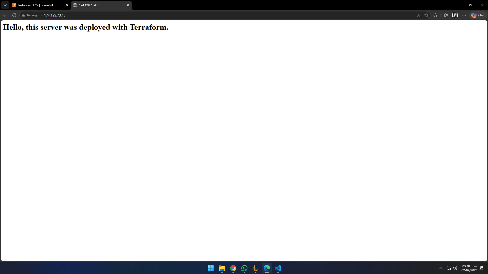

# AWS Infraestructure automation with Terraform

## **Project description:**
This repository containst the Infraestrcuture-as-code (IaC) configuration for the automated deployment of a secure web server on Amazon Web Services (AWS).

The main objective is to demonstrate skills in cloud resource orchestration, network segmentation (VPC), and deployment automation using Terraform, eliminating manual processes and reducing the margin of error.

## **--Network architecture--** 🌐
The infraestructure follows AWS best practices for scalable environments:
- Custom VPC: Isolated network with CIDR block "10.0.0.0/16"
- Public subnet: Designed to host resources with internet access.
- Internet gateway (IGW): Gateway to enable bidirectional communication between the VPC and the internet.
- Security group: Configured under the least privilege principle, allowing only the following traffic:
    -> HTTP (Port 80): For public access to the web server
    -> SSH (Port 22): For remote management and administration

## **--Technology stack--** 🛠️
- Cloud provider: AWS (EC2, VPC, subnets, route tables) ☁️
- IaC: Terraform v1.14.7
- Web server: Apache on Amazon Linux
- Automation: Bash scripting (user data= for automatic service installation and configuration

## **--Deployment guide--** 
1. Prerequisites: Have Terraform and AWS CLI installed.
2. Configuration: Run 'aws configure' with IAM credentials.
3. Initialization: Run 'terraform init' to download the AWS providers.
4. Planning: Run 'terraform plan' to validate the resources to be created.
5. Execution: Run 'terraform apply -auto-approve'

## **--Deployment evidence--** 📸
Once the instance is deployed, you can access the generated public IP address to verify the server's functionality:

---
### By Paola López | Cloud Security Engineer | AWS Certified Solutions Architect - Associate
